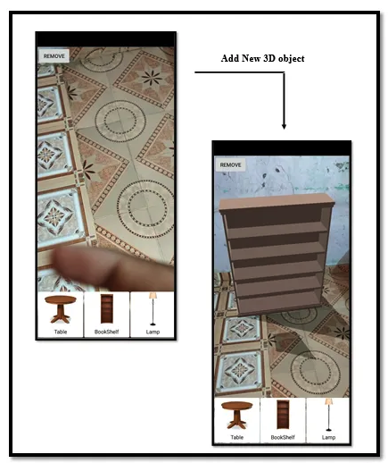
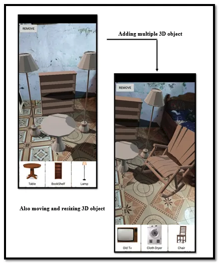
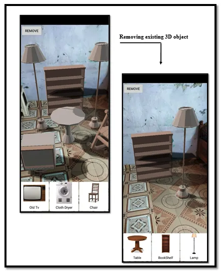

# Interior-design-app-using-AR
It is a mobile application in which the furniture and furnishings will develop in the three-dimensional surface of object and present by using augmented reality. It is an application that can be used on mobile phones, tab etc. especially using the Android platform to choose furniture that is suitable for their house.

## Objectives of the project:

- To create an interior design application using augmented reality technology.
- To provide users with a new interactive technology to be practised in interior design.
- To develop an augmented reality mobile application in 3D interior design that more convenient to the user.
- To produce realistic virtual furniture models in interior design similar to the real furniture.

## Project Demo Video

[Demo Video](https://drive.google.com/file/d/1bXhQwKHg6HTKeNEQ-UV3w6jq0hhLORXP/view?usp=sharing)

## Project Screenshots

## ARCore uses three key technologies to integrate virtual content with the real environment:

- Motion Tracking: it allows the phone to understand its position relative to the world.

- Environmental understanding: This allows the phone to detect the size and location of all type of surfaces, vertical, horizontal and angled.

- Light Estimation: it allows the phone to estimate the environment’s current lighting conditions.

## Project Scope

1. User — Everybody who has a mobile gadget uses the augmented reality application to design their room or house with virtual 3D objects.

2. Furnishing companies — Implement augmented reality applications with virtual 3D representations of furniture and furnishings for their customer.

3. Interaction technique — Three types of gestures have been provided in this application such as drag, pinch and rotation gestures. Users can drag, rotate, enlarge and minimize the furniture model in order to fit in their house. At the same time, the user can view different dimensions of the 3D virtual object such as the front view, side view and back view of the model by rotating the model with fingers.

4. Content application — The application is an interactive AR application. The model focus is the furniture of the living room. So, the 3D models that develop will be the furniture of the living room. In order to use this application, the user needs to have a camera on their device. After that, the user just needs to install the application, turn on the application and point the camera to the living room. Users can take a picture of the design space and set the image as a tracking pattern. Then, the user can choose the furniture from the list and the sofa’s image will be overlaid on the room. The whole process can then be reset by reactivating the camera. Last, a screenshot can be saved for further reference.

The Augmented Reality Technique has become a hot issue in the field of computer vision technology, with its different user experiences, slowly and deeply changing people’s lives, which includes many different fields such as education, medicine, advertising and so on. The study of the Augmented Reality Technique is mainly divided into two directions, one is implementing camera 3D registration by identifying the markers in the scene, and the other is updating camera pose by doing 3D reconstruction of the unknown scene, rendering the virtual objects in real-time. This mainly used the second method to research, realized the Virtual Home Augmented Reality System, which can support auxiliary information to people when decorating and selecting furniture, help users feel the placement of furniture in the room in advance before putting it in.
